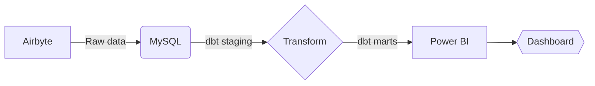

```
Complete-Data-Engineering-and-Analysis-Project

Data Pipeline: Airbyte → MySQL → dbt → Power BI

A collaborative data pipeline for extracting, transforming, loading and visualizing data. Built for data engineers (Airbyte, dbt, MySQL) and analysts (Power BI) to work seamlessly together.

---

Tools Used

- Extract: [Airbyte] (https://airbyte.com/) (Configured YAML connectors)
- Storage: [MySQL] (https://www.mysql.com/) (On-premise database)
- Transform: [dbt] (https://www.getdbt.com/) (SQL-based transformations)
- Visualize: [Power BI] (https://powerbi.microsoft.com/) (DAX/metrics dashboards)

---
```

Repository Structure

```
complete-data-engineering-and-analysis-project/
├── extract/        # Airbyte configs + source connectors
├── transform/      # dbt models (staging → marts)
├── visualize/      # Power BI reports + DAX
├── orchestration/  # Docker + Airflow setup
└── datasets/           # Raw → Processed → Power BI datasets
```

---

Team Responsibilities
| Role                | Tasks                          | Key Files/Dirs                   |
|---------------------|--------------------------------|----------------------------------|
| Data Engineers  | Airbyte setup, dbt pipelines   | `extract/`, `transform/dbt/`         |
| Data Analysts   | Power BI reports, dbt marts    | `visualize/`, `transform/dbt/marts/` |

---

Quick Start

For Data Engineers
1. Set up infrastructure:
   ```bash
   docker-compose -f orchestration/docker-compose.yml up -d
   ```
2. **Run dbt models**:
   ```bash
   cd transform/dbt/
   dbt run --models staging   # First transform layer
   dbt run --models marts    # Business-ready tables
   ```

### For Data Analysts
1. **Connect Power BI** to MySQL database:  
   - Server: `localhost` (or on-premise IP)  
   - Database: `marts` (dbt-generated tables)  
2. Open `visualize/powerbi/template.pbix` as a starter report.

---

Configuration

### Airbyte Sources
Edit YAML configs in `extract/airbyte_config/`:
```yaml
# Example: Salesforce to MySQL
source:
  type: "salesforce"
  client_id: "${SF_CLIENT_ID}"  # Env variables
destination:
  type: "mysql"
  host: "onprem-db.company.net"
```

### dbt Profiles
Update `transform/dbt/profiles.yml` for MySQL:
```yaml
onprem_project:
  target: dev
  outputs:
    dev:
      type: mysql
      host: "{{ env_var('MYSQL_HOST') }}"
      schema: analytics
```

---

## Collaboration Guide

1. **Data Engineers**:
   - Maintain clean staging models in `dbt/models/staging/`.  
   - Document schemas in `docs/data_dictionary.md`.  

2. **Data Analysts**:
   - Build metrics in `dbt/marts/` (e.g., `customer_lifetime_value.sql`).  
   - Version-control Power BI datasets (use **Git LFS**).  

---

## Airbyte → MySQL → dbt → Power BI Flow


---

## License
Nexsis Analytics Teams © 2025 [Estifanos Alamirew, Abel Solomon, Ruhama Abraham, Michael Mesfin, Ramlla Akmel, Hanif Mohammednasir, Sead Mohammed].  
**Note**: Power BI files (.pbix) require [Git LFS](https://git-lfs.github.com/).
```
